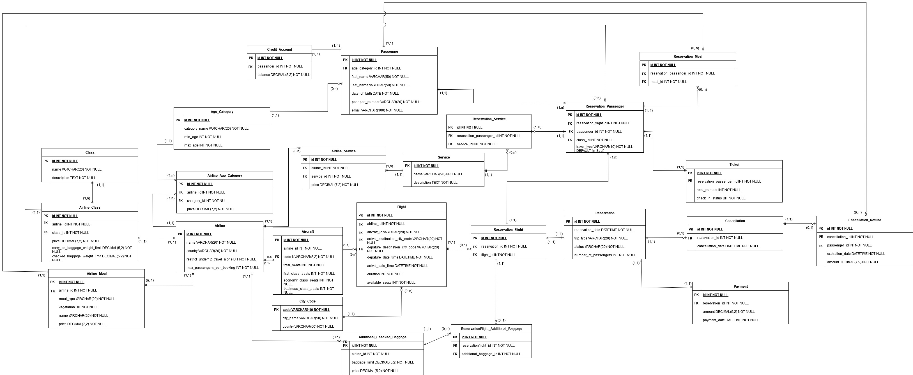

# TravelSafe Airline Ticketing System - SQL Server Database Solution

**Introduction**

This project is a complete database solution developed for TravelSafe, an airline ticketing system. It manages essential airline operations such as flights, reservations, meals, and payments. Built using Microsoft SQL Server, this project ensures efficient handling of airline reservations and related processes, incorporating advanced constraints, stored procedures, triggers, and optimization techniques to maintain data integrity and improve system performance.


**Features and Functionality**

+ Flight Management: Tracks flight schedules, available seats, and meal options.
+ Reservation System: Manages reservations, payment processing, and ticket issuance.
+ Meal Preferences: Handles meal selections and ensures availability based on passenger requests.
+ Payment Processing: Processes payments and automatically issues tickets upon successful transactions.
+ Optimized Performance: Includes various optimization techniques for efficient data processing.


**Tools Used**

+ SQL: For data manipulation and query execution.
+ Microsoft SQL Server: Relational Database Management System for storing and managing airline data.
+ Draw.io: For designing the database schema


**ERD Diagram**




**Database Structure Overview**

+ Flights: Stores flight information such as flight number, available seats, and schedule.
+ Reservations: Manages reservations, linking passengers to flights and processing ticket issuance.
+ Passengers: Stores passenger details, including contact information and preferences.
+ Payments: Handles payment details related to reservations.
+ Meals: Stores meal information, including meal preferences and availability for each flight.
+ ReservationDetails: Captures detailed information about each reservation, including flight details, payment status, and passenger information.


**Constraints**

+ Flight Constraints: Ensures valid flight schedules and seat availability.
+ Airline Meal Constraints: Ensures meal availability on selected flights based on passenger preferences.
+ Reservation Constraints: Validates reservation details such as available seats and payment processing.

**Stored Procedures**

+ GetReservationTotalPrice: Calculates the total price of a reservation, including flight costs and additional services.
+ ProcessPaymentAndIssueTickets: Processes payments and automatically issues tickets after successful transactions.
+ CancelReservation: Cancels a reservation and updates the availability of seats.

**Triggers**

+ CheckFlightModification: Triggered when flight details are modified to ensure valid schedule changes.
+ CheckMaxPassengers: Validates that the maximum passenger limit is not exceeded when a new reservation is made.
+ UpdateAvailableSeatsOnReservationCancellation: Updates seat availability when a reservation is canceled.

**Optimization Techniques Used**

+ Indexing: Applied to frequently queried columns for faster data retrieval.
+ Caching: Implemented for frequent queries to reduce database load.
+ Denormalization: Applied in specific areas to enhance read performance for critical queries.
+ Partitioning: Used to split large tables into smaller, manageable segments for improved query performance.

**Getting Started**

+ To set up the TravelSafe Airline Ticketing System database locally, follow these steps:

1. Install SQL Server: Ensure that Microsoft SQL Server is installed on your local machine.
2. Clone the Repository: Clone the repository to your local machine using:
```
git clone https://github.com/ShriraamNagarajan/TravelSafeDatabase.git
```
3. Import SQL Scripts: Run the provided SQL scripts to set up the database schema and populate the tables with initial data:
```
sqlcmd -S servername -i travelsafe_database_creation.sql
```


**Future Enhancements**

+ Flight Recommendations: A future feature to recommend flights based on passenger preferences and previous bookings.
+ Advanced Reporting: Adding more detailed reporting features for flight performance and customer trends.
+ Integration with Payment Gateways: Integration with external payment gateways for smoother transactions.

**Contact Information**

+ For any questions, suggestions, or feedback, please feel free to reach out:
  + Email: shrirajan331@gmail.com
  + LinkedIn: https://www.linkedin.com/in/shriraam-nagarajan-827b38198/

Thank you for checking out this project! 😊
